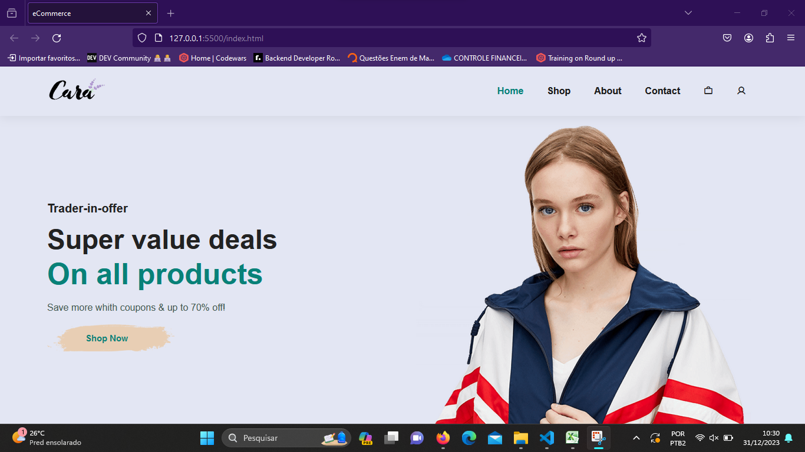
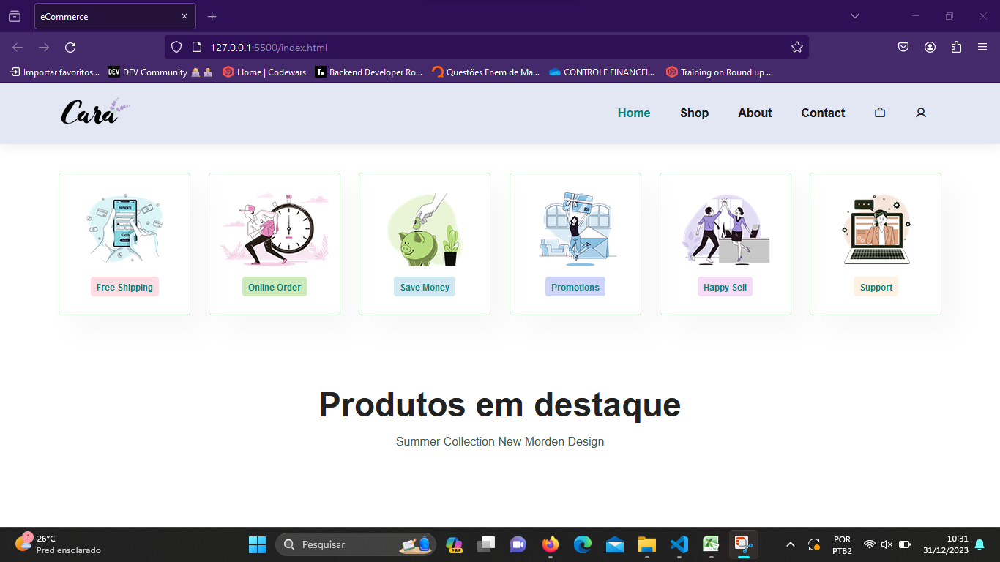
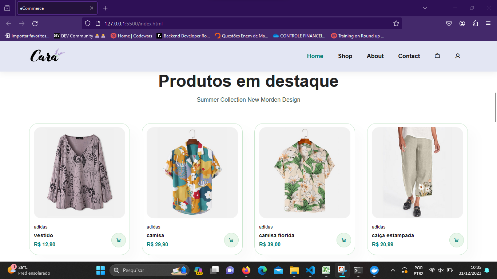
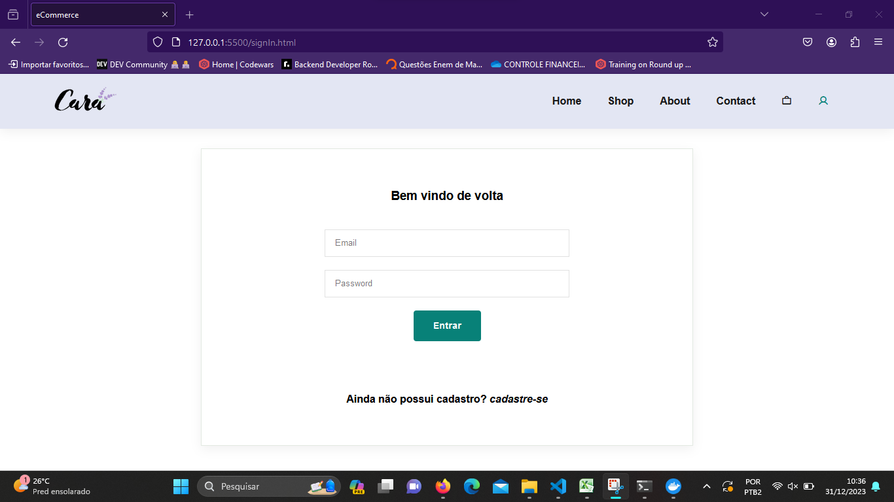
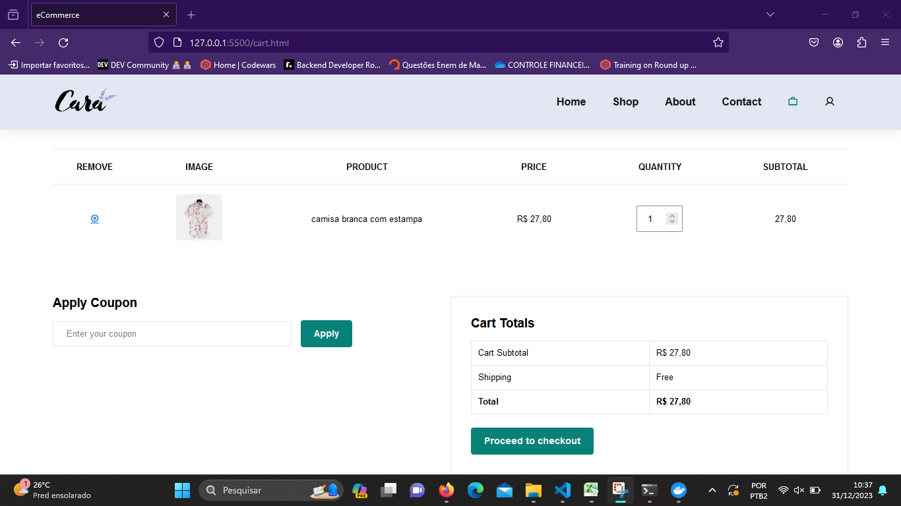
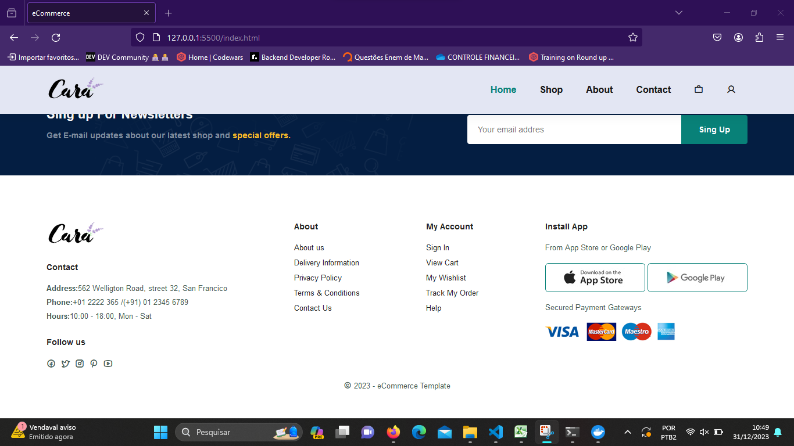

<h1 align="center">E-commerce</h1>

E-commerce para encontrar e anuncia produtos

## 💻 Sobre o projeto

 E-commerce - é um tipo de comércio que consiste em negociações feitas por meio de dispositivos eletrônicos.

---

## 🎨 Layout

### Web

  
  
  
  
  
  

## 🚀 Como executar o projeto

Este projeto é divido em três partes:
1. Backend (pasta server) 
2. Frontend (pasta eCommerce)

💡O Frontend precisa que o Backend esteja sendo executado para funcionar.

### 🛠 Tecnologias

As seguintes tecnologias foram usadas na construção do projeto:

- [HTML](https://developer.mozilla.org/pt-BR/docs/Web/HTML)
- [css](https://developer.mozilla.org/pt-BR/docs/Web/CSS)
- [JavaScropt](https://developer.mozilla.org/pt-BR/docs/Web/JavaScript)

### Autor
---
 
  
 <b>Kevin Silva</b> 🚀

Feito por Kevin Silva 👋🏽 Entre em contato!

 

